# FaceLite - A Simple Social Networking Application

  
  

## Table of Contents

1. [Introduction](#introduction)
2. [Project Overview](#project-overview)
3. [Getting Started](#getting-started)
4. [How to Use](#how-to-use)
5. [Main Class](#main-class)
6. [BuildScreen Class](#buildScreen-class)
7. [Profile Class](#profile-class)
8. [Adding Class](#adding-class)
9. [Changing Class](#changing-class)
10. [Content Class](#content-class)
11. [Users Class](#users-class)
12. [Extra features added to the project: to enhance the users' experience](#extra-features-added-to-the-project-to-enhance-the-users-experience)


## Introduction

FaceLite is a straightforward social networking application developed in Java. The project aims to simulate a basic social network where users can create profiles, connect with friends, and share their current status.


## Project Overview

The FaceLite application manages the information in a simple social network using JavaFX. Users can perform the following actions:

- Add a new profile
- Delete a profile
- Look up a profile
- Change the current status
- Change the current profile image
- Add friends to a profile
- Deleting friends from a profile.
  
## Technologies Used:
- JavaFX.
- Visual Studio Code.


## Getting Started
To run the FaceLite application, follow these two steps:
1. Open the project in your preferred Java IDE.
2. Run the `Main` class.

  

## How to Use
1. Launch the application.
2. Use the "Add" button to create a new profile.  
3. Use the "Delete" button to remove a profile.
4. Use the "Lookup" button to search for a profile.
5. Use the "Change Status" and "Change Picture" buttons to update user information.
6. Use the "Add Friend" button to connect with other profiles.

  

## Main Class

### Purpose:

The `Main` class goal is to start the application using a method named start.
The `Main` class is used to call the `BuildScreen` class in order to proceed in the application.

### Variables:
- `windows` of type Stage.
  
### Methods:
- `start`:  used to launch the application. 


## BuildScreen Class

### Purpose:
The `BuildScreen` class goal is mainly concerend with the stage and setting all its' alignments, calling most of the classes of the project, such as `Adding` class, `Changing` class, and `Content` class. Furthermore, keeps updating the data shown on the screen.

### Variables:
`stage`: Considered to be the main stage.
`mainScene`: To control what is displayed in the stage
`content`: It is the main part of the scene.
`changing`: Part of the scene, that controls what is the left side of the scene and considers changing user information.
`adding`: Part of the scene, that controls what is the top head of the scene and considers the profile itself.
`users`: To store the users' informations.
`updated`: To display a massage stating what have happened to the program.
`pane`: It is comes from the BorderPane class from JavaFX, using to organize main parts of the scene.
`usersDataBase`: To store the users' information after closing the program

### Methods:
- `start`:  used to launch the application. 
 
```java
public  void  buildGUI()  {
// This method using to display welcoming screen after launching the program. After that, it will going to switch to the main scene using switchToMainScene()
}

public  void  closeProgram()  {
// This method using to confirm that the user wants to exit the application.
}

private  void  switchToMainScene()  {
// This method using to build all main parts of the screen, such as adding class, changing class, and content class.
}
```

## Profile Class

### Purpose:
The `Profile` class goal is mainly concerend with the profile of each user, each user has a unique profile consisting of a name, image, status, and a list of friends.

The profile class uses the `Adding`, `Changing` classes to manipulate the profile from each user by getting the information that is needed to be changed by these classes.

### Variables:
`name`: To store user's name.
`status`: To store user's status.
`profileImage`: To store user's profile image.
`friends`:  To store user's friends list.

### Methods:
```java
public  String  getName()  {
// Used to return user's name.
}

public  String  getStatus()  {
// Used to return user's status.
}

public  String  getProfileImage()  {
// Used to return user's profile image.
}
```
### Contructor class:
We use Profile class to display users' information into the scene.

## Adding Class

### Purpose:
 
The `Adding` class is one of the base classes in the project, where it can change many information, it can add, delete, or lookup a profile. Furthermore, it changes some of the displayed information using the `Content` and `Updated` classes.

- Add button is concered with adding a new profile.

- Delete button is concered with deleteing an existing profile.

- Lookup button is concered with searching an existing profile.

### Variables:
`add`: To add the user profile and store it into the users' data.
`delete`: To delete the user profile and delete it from the users' data.
`lookUp`: To lookup a user profile.
`settings`:  Setting modes for the background of the scene.
`nameUser`: To get user's name from a text field.
`pattern`: Limited string characters for writing a user's name.

### Methods:
```java
public  Content  getContent()  {
// To return the content from the Content class.
}
```  
### Contructor class:
We use Adding class to build the buttons and text fields in the top of the scene.


## Setting Class:
### Purpose:
The `Setting` class is one of the popular method using in any application, where the user can change the screen mode in the scene. Users can change the mode into either night, white, or sky mode.

### Variables: 
`options`: To cleck one the list of options using `ChoiceBox` class from JavaFx.

### Methods:
```java
public  void  setBackground(Color  color)  {
// Using to set the color screen from the content class.
}
``` 
 
## Changing Class

### Purpose:
The `Changing` class is one of the base classes in the project, where it can change many information, it can change the status, picture, and add friends. Furthermore, it changes some of the displayed information using the `Content`, `Updated`, and `Users` classes.

- ChangeStatus button is concered with changing the status of an existing profile.

- ChangePicture button is concered with changing the picture of an existing profile.

- AddFriend button is concered with add with an existing friends to the an existing profile.

-  `Changing` class stores the new information gotten from the text fields into the `Users` class.

### Variables:
`changeStatus`: To change the users status.
`changePicture`: To change the users status.
`addFriend`: To add the friend into the user's friend list.
`deleteFriend`:  To delete the friend from the user's friend list.

## Content Class

  
The `Content` class is one of the base classes in the project and it is part of the `BuildScreen` , where it can change many information, this class is concerned with the bottom right of the program display (name, picture, status, friends, and the massage in the bottom) where it is mainly (updating) the actual profile displayed and the massages that are shown in the bottom using the `Users`, and `Updated` classes.

### Variables:
`profile`: A variable to control which profile is displayed on the screen.
`updated`: To create a box of the massage displaying what is new in the program.
`vBox`: To set the vertical box of the application and set the alignments.

### Methods:
`getProfile`: Return the current profile working with.
`updateContent`: To change the profile that is displayed on the screen. 
`updatedMessage`: To change the massage in the bottom with a suitable massage.
  

## Updated Class

### Purpose: 

The `Updated` class is a simple-short class designed to control the massages displayed in the bottom of the application, it displays what action have happened recently and did the program accept the action or not (I would show that the action did not happen, for instance, if the user tried to change some information of non existing profile ), and it is called by each class since each class wants the massage displayed in a different form or text.

### Variables:
`message`: A string massage that is displayed in the bottom of the screen stating what is the latest action in the application. 
`messageL`: A label to display the massage in.

### Methods:
`setMessage`: To take a string from the last function used and display it on the screen.
  

## Users Class

### Purpose:
The `Users` class is one of the main classes of the project since it stores the information of each user.

This class uses dictionary to store the information, taking the name of the user as a key and (status, picture, friends) as a value, it also checks whether a certain username already exists or not by search in the dictionary using the key name, many other classes use this class in-order to get the information of users and handle them accordingly.

### Variables:
`userData`: A hashMap to store the users' data while running the program, taking `users`: names as key and other informations as a value in the form of an array.
`usersDataBase`:  A file to store the users' information after closing the application in a file.


### Methods:
`getUser`: To return the user's name from the hashMap of users.
`checkUser`: To check if the user name exists or not.
`updatePathImage`: To update the users' profile image and change it in the hashMap.
`updateStatus`: To update the users' status and change it in the hashMap.
`addingFriends`: To update (add)  the users' friend list and change it in the hashMap.
`deletingFriends`:To update (delete)  the users' friend list and change it in the hashMap.
`readFromFile`: To read the users' data from the last time the application ran, and store their information in a hashMap to proceed in the program.


### Note:

#### All buttons and labels are designed using `setFont` method and importing fonts from Google Fonts Online.

### Example Code:

```java

changeStatus.setFont(Font.loadFont(getClass().getResourceAsStream("assests/fonts/Quicksand/static/Quicksand-Bold.ttf"),12));
changePicture.setFont(Font.loadFont(getClass().getResourceAsStream("assests/fonts/Quicksand/static/Quicksand-Bold.ttf"),12));
addFriend.setFont(Font.loadFont(getClass().getResourceAsStream("assests/fonts/Quicksand/static/Quicksand-Bold.ttf"),12));
deleteFriend.setFont(Font.loadFont(getClass().getResourceAsStream("assests/fonts/Quicksand/static/Quicksand-Bold.ttf"),12));

```

## Usage:

1. Start the program


2. Write the desired name of the new user profile and then click Add

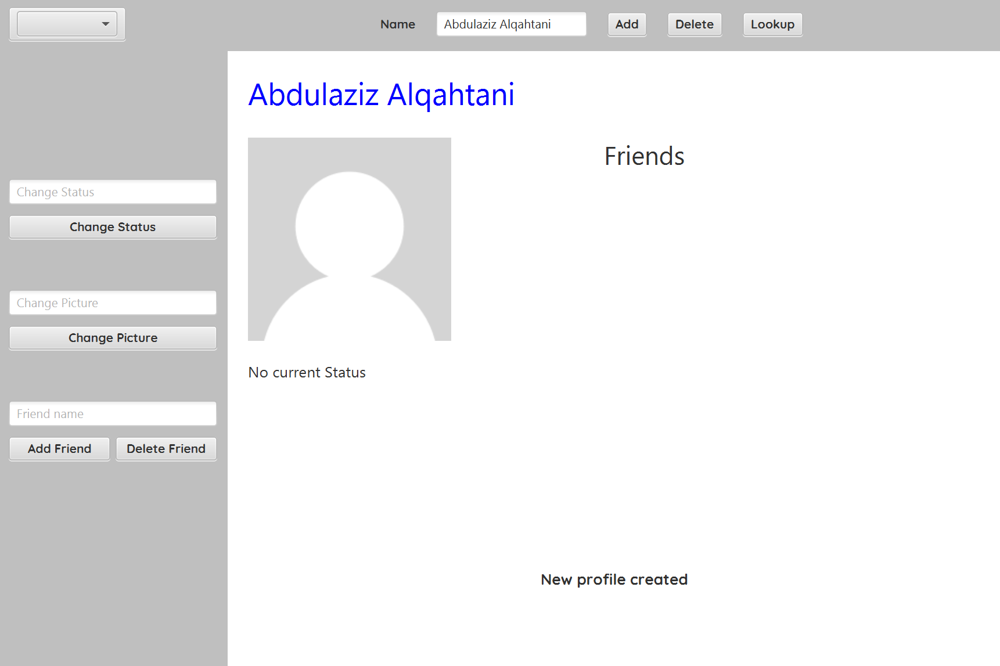

#### Then the following action could be made:

- Invalid input example after clicking Change Status.
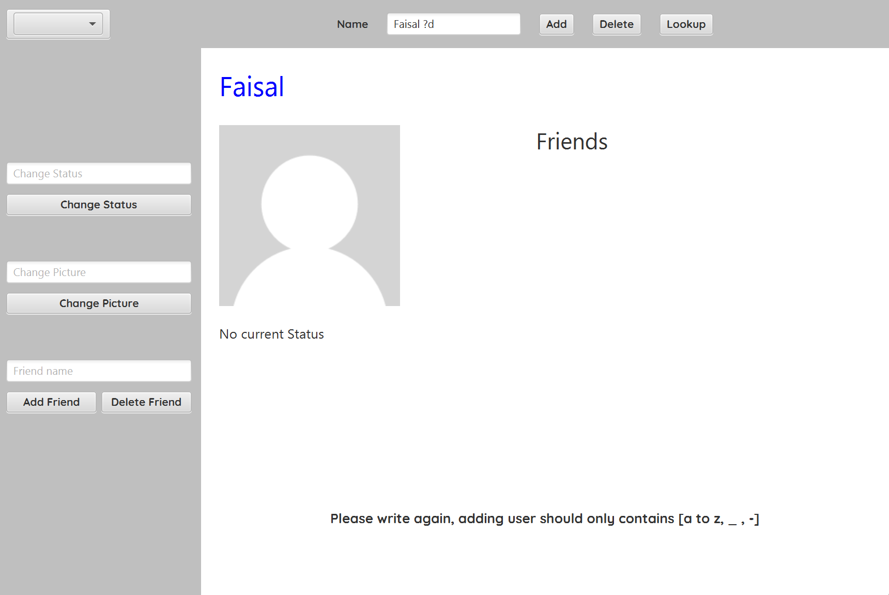

- Changing that user's status and clicking Change Status.
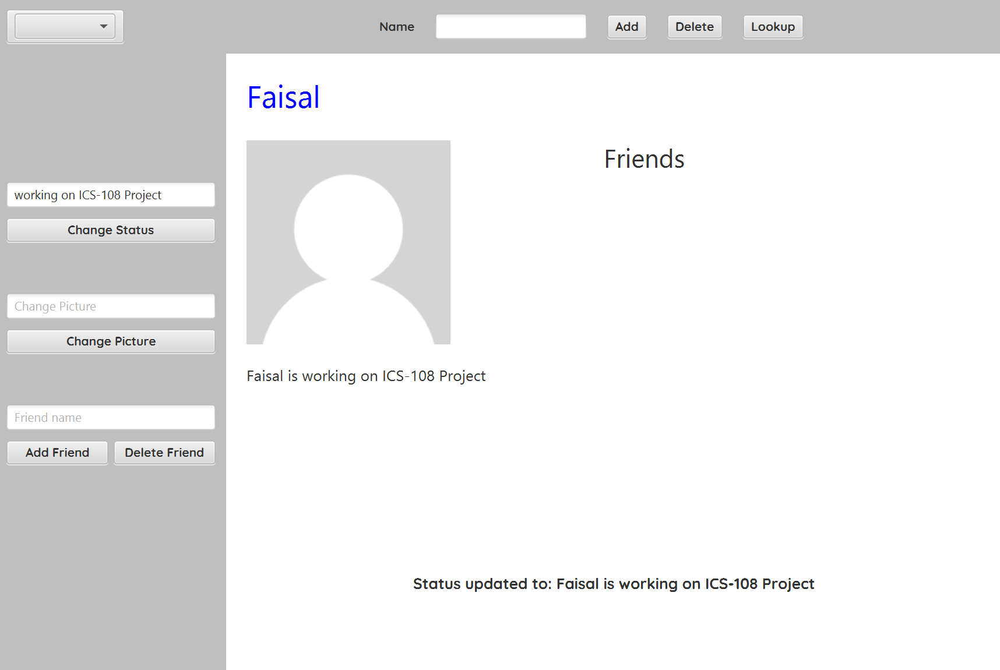

- Invalid input example after clicking Change Status.


- Changing that user's profile image and clicking Change picture.  


- Invalid input example after clicking Change Status.


- Adding a new friend by writing the friend's name in the textfield and clicking Add friend (there must be a profile associated with the given name)  

- Invalid input example after clicking Add or Delete friend.


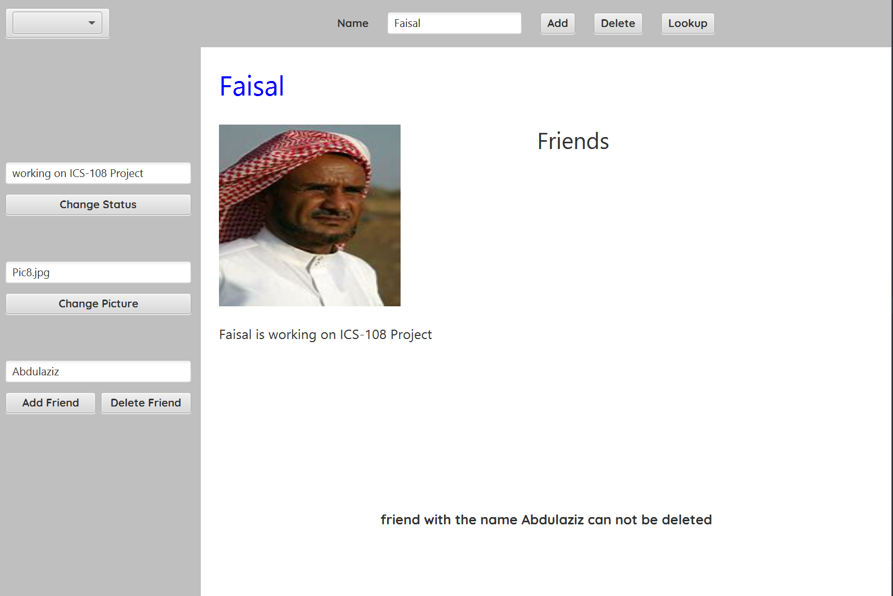

- Deleting a friend by writing the friend's name in the textfield and clicking Delete friend (there must be a profile associated with the given name)  

Steps before that, suppose there is a new profile's name Abdulaziz.

1) Adding new Profile
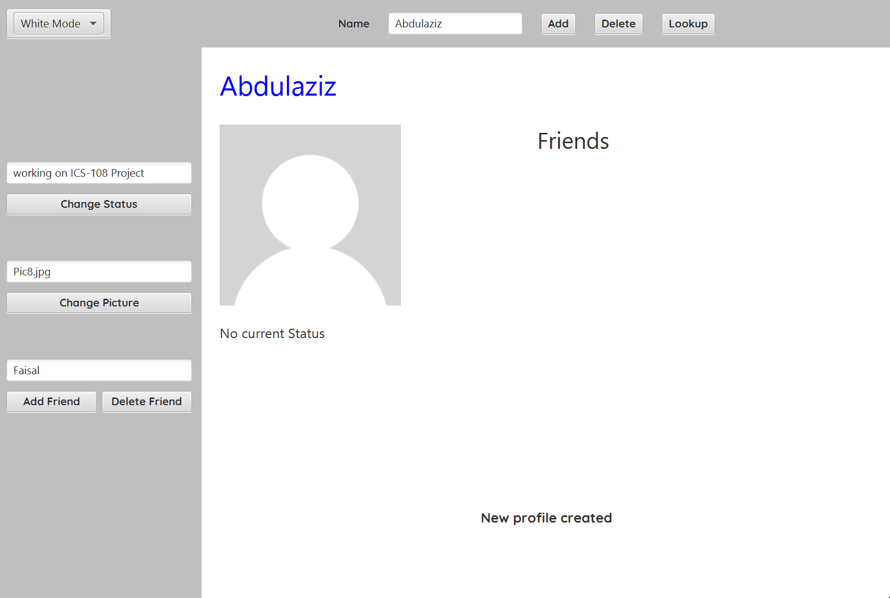

2) Adding friend to Faisal
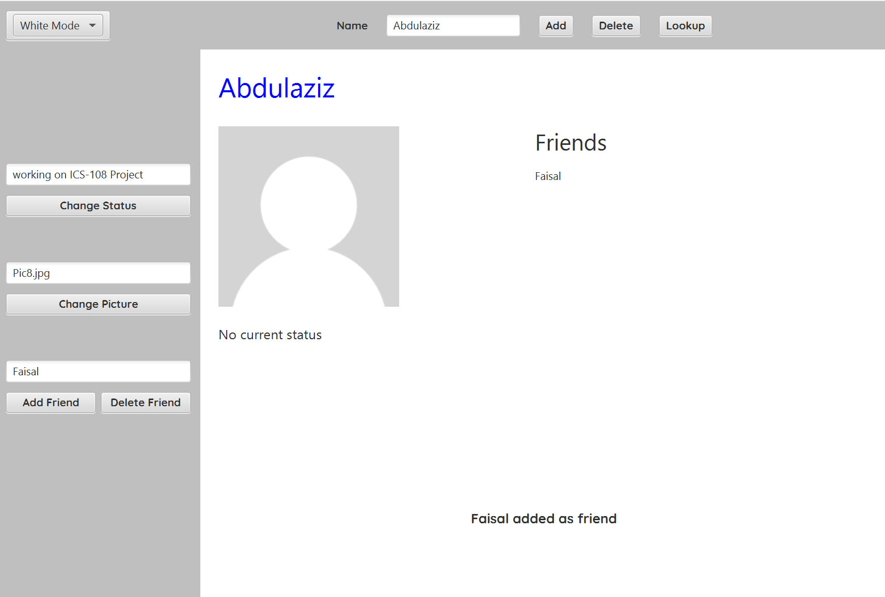

3) Going to Faisal's profile
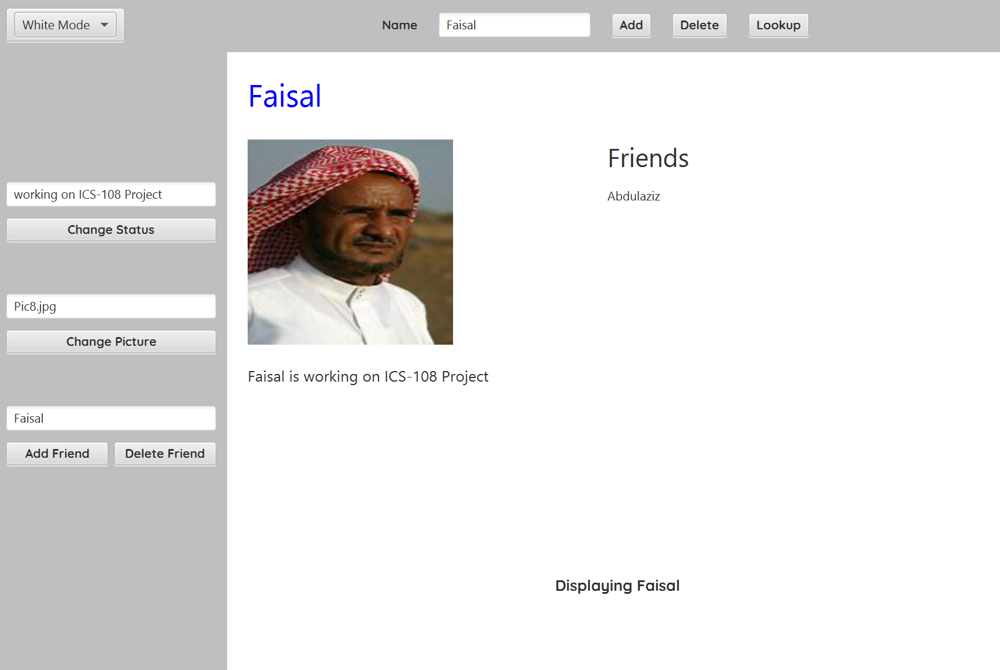

4) Using `Delete Friend` button.


- Can write the name of a specific profile and clicking Delete to delete that profile (there must be a profile associated with the given name).  

- Can write the name of a specific profile and clicking LookUp to display that profile (there must be a profile associated with the given name).  

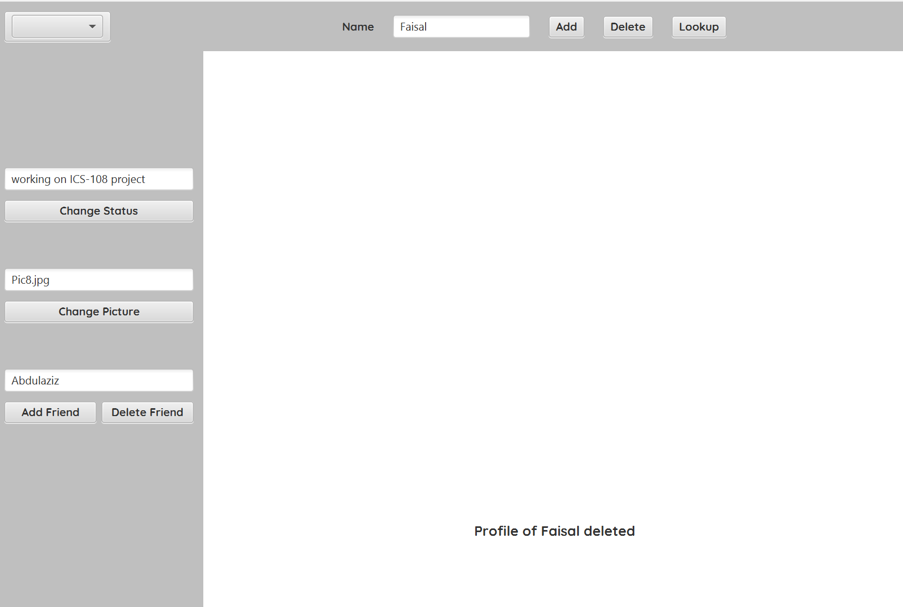

In general, the program displays the user's name, status, profile image, list of friends, as well as an updating massage mentioning what was the last action preformed by the application.

Some of the application 's functions are the following:

- Theme mode, to change the background color of the application.
1) #### Night Mode

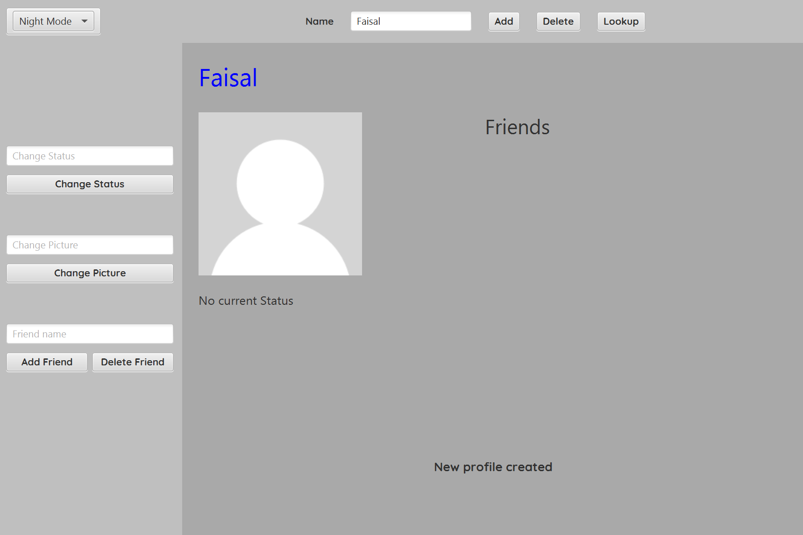

1) #### White Mode


1) #### Sky Mode

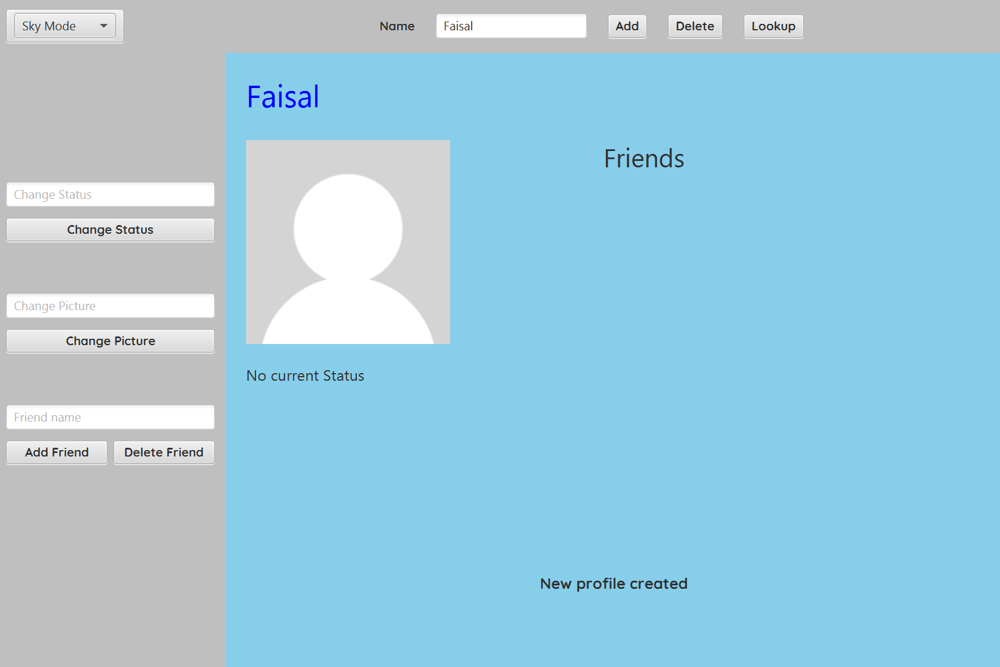


- Confirming massage to check if the user wants to actually close the application.

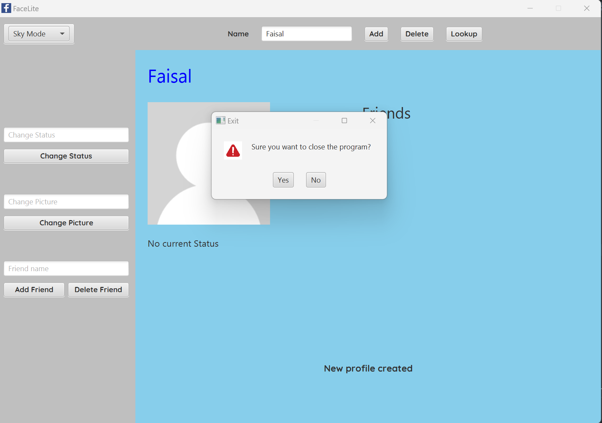
  
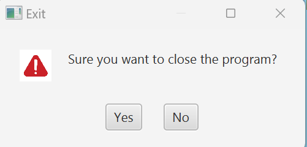


## Extra features added to the project: to enhance the users' experience


- Changing the mode:
Changing the look of the screen in order to make a more suitable experience for all users.

- Confirming exist program:
A massage that pops up after pressing the ket to close the program, showing a massage asking to confirm that the user wants to exist the program.

- Application interface:
A slow shading interface welcoming the user including the program logo.

- Saving users' data:
Saving the users' data even though after existing the program in a file, and the program would read this file whenever the program again to restore the information of the users.

- Deleting friend button:
Added a new button named 'Delete friend' if the user wanted to delete a friend from the friend list without deleting the friend's profile.
